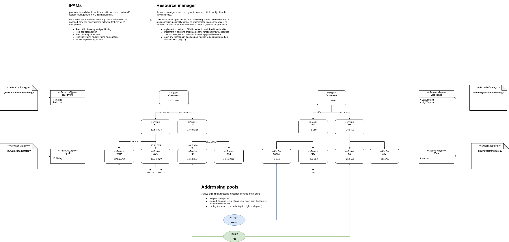
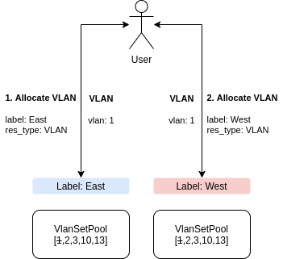
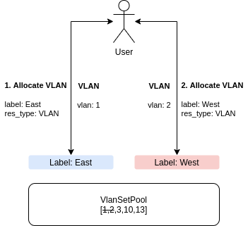
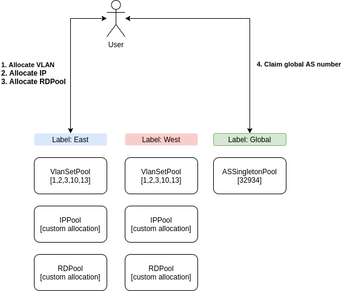
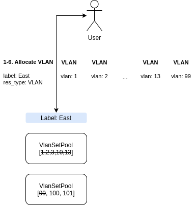
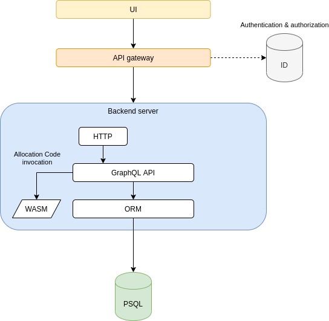
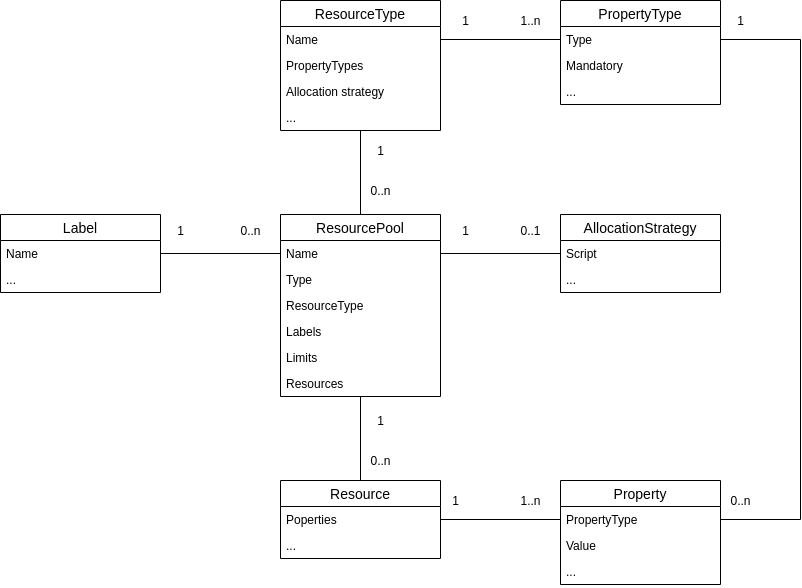

# Resource manager

A generic/extensible resource management system.

Resource manager is responsible for claiming/deleting/tracking and overall management of resources
such as IPv4 and IPv6 addresses, IPv4 and IPv6 prefixes, VLANs and VLAN ranges and
any other (user defined) resource. 

## Features

Following list contains features inherent to Resource Manager.

### Resource type management

Resource type is a blueprint for how to represent a resource instance. 
A resource type is essentially a set of property types, where each property type defines:

*   Name: name of the property
*   Type: int, string, float etc.

Example resource types:

*   **VLAN**
    *   Property type
        *   Name: vlan
        *   Type: int
*   **Route distinguisher**
    *   Property type
        *   Name: RD
        *   Type: String
*   **Location**
    *   Property type
        *   Name: Latitude
        *   Type: float
    *   Property type
        *   Name: Longitude
        *   Type: float

Resource Manager is flexible enough to enable user defined resource types without requiring code compilation or any other non-runtime task. 
With regard to resource types, this requires keeping the schema flexible enough so that users can define their own types and properties and thus create their own model.

### Resource management

A resource is an instance of a resource type consisting of a number of properties.

Example resources based on resource types from previous section:

*   **VLAN_1**
    *   Property
        *   Name: vlan
        *   Value: 44
*   **Route distinguisher_1**
    *   Property
        *   Name: RD
        *   Value: 0:64222:100:172.16.1.0
*   **Location_1**
    *   Property
        *   Name: Latitude
        *   Value: 0.0
    *   Property
        *   Name: Longitude
        *   Value: 0.0

#### Pools

A resource pool is an entity that allocates and deallocates resources for a single specific resource type.
Resource pools are completely isolated from each other and there can be multiple resource pools for the same resource type even providing the same resource instances.
Resource pools encapsulate the allocation logic and keep track of allocated resources. 
A pool instance should manage resources within the same network or logical network part (e.g. subnet, datacenter, region or the entire, global network). 

Example pools:

*   IPv4 address pool allocating IP addresses from a range / subnet
*   VLAN pool allocating all available VLAN numbers 0 - 4096
*   Route distinguisher pool allocating route distinguishers from a specific, per customer, input

Depending on resource type and user’s requirements, pools need to be capable of allocating resources based on various criteria / algorithms.
Currently, following pool types are supported by Resource Manager:

##### SetPool

Pool with statically allocated resources.
Users have to define all the resources to be served in advance.
The pool just provides one after another until each resource is in use.

This type of pool is suitable for cases where a set of resources to be served already exists.

Properties of SetPool

*   Config
    *   Set of unique resources to provide
    *   Name of the pool
    *   Resource recycling - whether deallocated resources should be used again
*   Operational
    *   Utilisation - % of pool capacity used

##### SingletonPool

SingletonPool serves just a single resource for every request.

This type of pool can be utilized in special uses cases such as serving a globally unique single AS number of an ISP. Instead of hardcoding the AS number as a constant in e.g. workflows, it can be “managed” and stored in the Resource Manager.

Properties of SingletonPool

*   Config
    *   A single unique resources to provide
    *   Name of the pool

##### AllocatingPool

AllocatingPool is a type of pool that enables algorithmical resource allocation. Instead of using a pre-allocated set of resources to simply distribute, it can create resources whenever asked for a new resource. This type of pool allows users to define a custom allocation logic, attach it to the pool and have use-case specific resource allocations available.
Important feature of this pool type is the ability to accept new allocation logic from users in the form of a script without having to rebuild the Resource Manager in any way.

This type of pool can be used when

*   a predefined set of resources cannot be used 
*   resource creation requires additional inputs
*   or in general whenever using an allocation script makes more sense then using a predefined set of resources

Properties of AllocatingPool

*   Config
    *   Allocation strategy - a script defining the allocation logic
    *   Name of the pool
    *   Resource recycling - whether deallocated resources should be used again
    *   Limit - hard limit on total number of resource that can be produced
*   Operational
    *   Utilisation - % of pool limit used

Example AllocationPools:

*   Pool providing all available VLAN numbers
*   Pool providing just odd VLAN numbers
*   Pool providing random VLAN numbers
*   Pool providing Route Distinguishers that include customer specific information (which is passed as “additional input” as part of resource claim request)
*   Pool providing IPv4-mapped IPv6 addresses from a specific range / subnet
*   In general, anything that a user might need

##### Allocation strategy overview

Allocation strategy encapsulates the allocation logic and is always tied to (an) instance(s) of AllocatingPool. The strategy is defined in form of a script using Javascript (or similar) language and its responsibility is:

To produce a new (unique) resource instance based on a set of previously allocated resources and any additional, user submitted input.

Apart from a resource being unique, there are no other requirements on what the strategy needs to do. It gives users the freedom to implement any logic.

Allocation strategy can take any input provided in a structure named `userInput`.
This input is provided by the user every time they claim a new resource.  

Allocation strategy also gets access to a `list of already allocated resources` and any `properties associated with the pool` being utilized.

#### Pool hierarchies

RM allows pools to be organized into hierarchies e.g.



### Labels

Labels enhance resource management by allowing a pool to be marked with a custom string. Multiple pools can have the same label forming a logical group of pools. 

A group of pools under the same label can be dedicated to some logical part of a network (e.g.  datacenter,  subnet, region etc.). 

A single pool should typically have only one label i.e. it should not be re-used across unrelated networks.   

The following diagrams represent some of the configurations that can be achieved using Labels:

Configuration: **Pool instance per Label**

Enables: Resource reuse in multiple networks



Configuration: **Pool instance under multiple labels**

Enables: Unique resources across different networks



Configuration: **Pool grouping**

Enables: Dividing resource pools into groups based on network regions. Enables users to simply ask for a resource based on label name + resource type (removing the need to know specific pools)



Configuration: **Multiple pool instances under the same Label**

Enables: Resource pool expansion in case an existing pool runs out of resources. Serves as an alternative to existing pool reconfiguration. If multiple pools of the same type are grouped under the same label, the pools are drained of resources in the order they have been added to this group/label.



### Flexible design 

One of the main non-functional goals of the Resource Manager is flexibility.
We are designing Resource Manager to support an array of use cases without the need for modifications.
To achieve flexibility we are allowing:

*   Custom resource type definition without changes in the DB schema
*   Custom allocation logic without the need to modify the backend code
*   Custom pool grouping to represent logical network parts (subnet, region, datacenter etc.)

### Multitenancy and RBAC

Multitenancy and Role Based Access Control is supported by Resource Manager.

A simple RBAC model is implemented where only super-users (based on their role and user groups)
can manipulate resource types, resource pools and labels.
Regular users will only be able to read the above entities, allocate and free resources.

RM does not manage list tenants/users/roles/groups and relies on external ID provider. 
Following headers are expected by RM graphQL server:
```
x-tenant-id:        name or ID of a tenant. This name is also used as part of PSQL DB instance name.
from:               name or ID of current user.
x-auth-user-roles:  list of roles associated with current user.
x-auth-user-groups: list of groups associated with current user.
```

RM does not store any information about users or tenants in the database,
**except the name or ID of a tenant provided in `x-tenant-id` header**.

### User Interface and API

Resource Manager will provide a GUI interface for manual resource management typically involving
a network admin setting up various resource types, pools and labels and resource allocation and deallocation to certain extent (mostly for testing purposes).

API suitable for programmatic access will also be available. Resource allocation and deallocation
will be typically handled directly via this API, invoked programmatically from external systems such as a workflow engine. 

## 2. Architecture

Following diagram outlines the high level architecture of RM.



User authentication and authorization as well as user and tenant management is outside of RM. RM is typically
deployed behind an api-gateway that handles authentication and authorization relying on an external Identity Managmenet system.

The only aspect of tenancy management that needs to be handled by Resource Manager is: per tenant database creation and removal.
Each tenant has its own database in database server.

## Technology stack

This section provides details on intended technologies to develop Resource Manager with.

Resource Manager will rely on technologies used by the Inventory project currently residing at: [https://github.com/facebookincubator/magma](https://github.com/facebookincubator/magma) since both projects are similar and have similar requirements.

*   Database
    *   [Entgo.io](https://entgo.io/)
        *   Ent is an ORM framework for go
        *   Also handles schema migration: creates or updates tables in DB according to ent schema
        *   RBAC rules can be defined as part of the schema
    *   Postgres
        *   PSQL is the DB of choice, but thanks to ent framework hiding the interactions with the database, other SQL DB could be used in the future
*   Backend server
    *   GraphQL
        *   Primary API of Resource Manager will be exposed over GraphQL (over HTTP)
        *   [Gqlgen](https://gqlgen.com/getting-started/)
            *   Gqlgen is a graphql framework for go
            *   Works well on top of entgo.io ORM
    *   WASM
        *   Web assembly runs any user defined code executing allocation logic for user defined resource pools
        *   Separate process
        *   Isolated and limited for safety and performance
*   AAA
    *   Tenant and user management is out of scope of Resource Manager and will be handled by an external identity management system.

## Entity model

Following diagram outlines the core entity model for Resource Manager:



// FIXME update the entity model based on [ORM schema](ent/schema)

## User guide

### API

See examples is [api_tests](api-tests)
or a VRF IP management sample use case in [postman collection](https://www.getpostman.com/collections/514d68c6e43f1628d715).

### UI

See RM frontend project on [github](https://github.com/FRINXio/resource-manager-frontend)

## Developer guide

### Dependency on symphony

:warning: **RM currently depends on a project called symphony.**

This project is not publicly accessible and without access to it, RM cannot be built.
In that case, use pre built docker images from dockerhub.

### Folder structure

* [ent](ent) - ORM schema and generated code for the DB
  * [ent/schema](ent/schema) - ORM schema
* [graph/graphql](graph/graphql) - graphQL schema and generated code for graphQL server
* [graph/graphhttp](graph/graphhttp) - graphQL server
* [pools](pools) - core codebase for pools and resoruce allocation
* [viewer](viewer) - multitenancy, RBAC and DB connection management
* [psql](psql) - psql DB connection provider
* [logging](logging) - logging framework
* [api-tests](api-tests) - integration tests 
* [pkg](pkg) - helm chart for RM

### Build

It is advised to build RM as a docker image using [Dockerfile](Dockerfile)
and run it as a docker container.

The reason is that RM uses wasmer and pre built js and python engines for wasm.
These are not part of the codebase and thus simply running RM would fail, unless you provide these resources
e.g. by copying them out of RM built docker image.

:warning: RM utilizes wire to generate wiring code between major components.
Regenerating wiring is not part of standard build process !
After modifying any of the `wire.go` files perform:
```
wire ./...
```

### GraphQL schema

RM exposes graphQL API and this is the [schema](graph/graphql/schema/schema.graphql).

### Built in strategies

RM provides a number of built in strategies for built in resource types and are loaded into RM at startup. 

[Built in strategies code base](pools/allocating_strategies/strategies/)
[Built in strategies unit tests](pools/allocating_strategies/strategies/src/tests)

[Built in strategies integration tests](pools/allocating_strategies/strategies/src/tests/)

These strategies need to be tested/built and packaged for RM.
This test/build process in scrips section of [package.json](pools/allocating_strategies/strategies/package.json)
while the packaging part can be found in [generate.go](pools/allocating_strategies/generate.go). 

Resource types associated with these strategies can be found in [load_builtin_resources.go](pools/allocating_strategies/load_builtin_resources.go).

### Unit tests
```sh
./unit-test.sh
```

### Integration tests

#### API tests

There's a number of [api tests](api-tests) available and can be executed using [integration-test.sh](integration-test.sh).
These tests need to be executed against RM running as a black box (ideally as a container).

#### Wasmer

There's a number of tests testing core components that require wasmer, quickjs and python packages to be available.
It is recommended to run these tests in a docker container. 

Example execution:
```sh
export WASMER_BIN=~/.wasmer/bin/wasmer
export WASMER_JS=~/.wasmer/globals/wapm_packages/_/quickjs@0.0.3/build/qjs.wasm
export WASMER_PY=~/.wasmer/globals/wapm_packages/_/python@0.1.0/bin/python.wasm
export WASMER_PY_LIB=~/.wasmer/globals/wapm_packages/_/python@0.1.0/lib/
go test -run Integration ./pools/...
```

## Additional info

### Telementry
Support for tracing (distributed tracing). Streams data into a collector such as Jaeger.
Default is Nop.
See main parameters or telementry/config.go for further details to enable jaeger tracing

### Health
Basic health info of the app (also checks if mysql connection is healthy)

```
# server can serve requests
http://localhost:8884/healthz/liveness
# server works fine
http://localhost:8884/healthz/readiness
```

#### Metrics
Prometheus style metrics are exposed at:

```
http://localhost:8884/metrics
```
